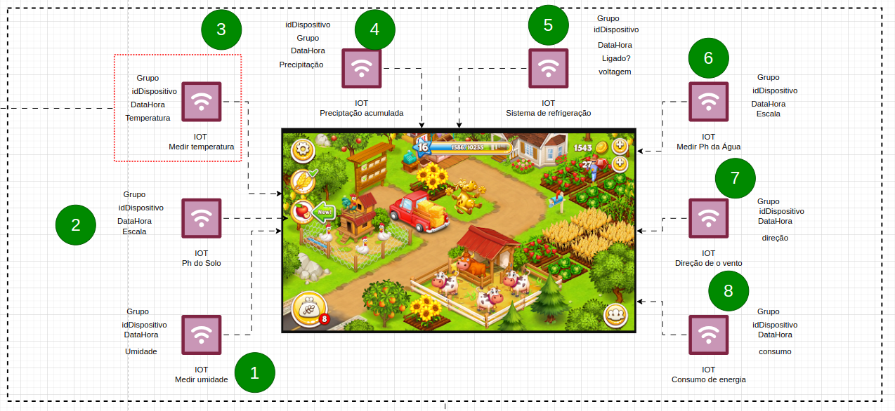
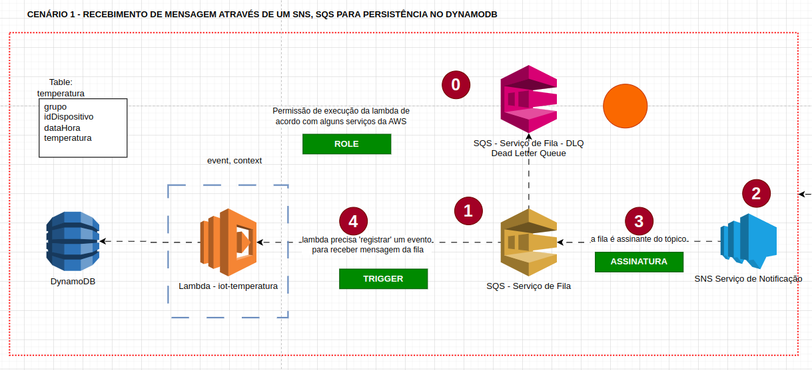
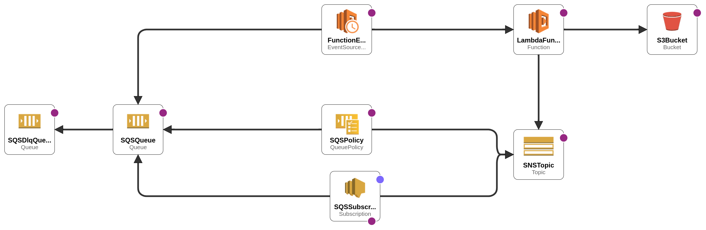

# Aula 17-02-2024

# FATESG

## Cenário/Problema:


## Integração entre os serviços AWS

Steps:

0. Criar fila morta
1. Criar fila 'normal' e vincular a fila morta na fila 'normal'
2. Criar o o SNS
3. Fazer o vínculo do SNS para SQS, ou seja, a mensagem que chegaram no sns iremos enviar para a SQS
4. Fazer a SQS 'triggar' ou disparar mensagem para a lambda




## Stack AWS



## Provisionamento do ambiente na AWS

### Criar o bucket via cli

Neste exemplo estamos utilizando o profile=aws_academy e region=us-east=1. Caso você esteja utilizando o profile default, não é necessário informar estes parâmetros (profile,region).

O nome do bucket deve ser único globalmente, portanto ao executar o comando abaixo, inserir um nome adequado ao uso do seu serviço. O nome inserir-um-nome-unico-globalmente já está em uso, use outro nome.

```shell
aws s3 mb s3://inserir-um-nome-unico-globalmente --profile=aws_academy --region=us-east-1
```


### Criar o arquivo zip do projeto

```shell
zip iot-consumo-energia.zip lambda.py requirements.txt
```

### Fazer upload do arquivo
```shell
aws s3 cp iot-consumo-energia.zip s3://inserir-um-nome-unico-globalmente/iot-consumo-energia.zip --profile=aws_academy
```

---
**NOTE**

Os comandos abaixo devem ser executados dentro da pasta do dispositivo. As pastas tem prefixo iot-*

---

### Criar a Stack no cloudFormation
```shell
aws cloudformation create-stack --profile=aws_academy --region=us-east-1 \
    --stack-name 'iot-consumo-energia-stack' \
    --capabilities CAPABILITY_IAM \
    --template-body file://$(pwd)/stack.yaml
```

## Acompanhar a criação da stack

```shell
aws cloudformation wait --profile=aws_academy --region=us-east-1 stack-create-complete \
    --stack-name 'iot-consumo-energia-stack'
```

## Deletar a stack
```shell
aws cloudformation delete-stack --profile=aws_academy --region=us-east-1 \
    --stack-name 'iot-consumo-energia-stack'
```

## Para atualizar somente a lambda

**Execução do método via cli - WINDOWS (CMD)**

```shell
aws lambda update-function-code --function-name %NOME_FUNCAO% --zip-file fileb://%ARQUIVO_ZIP%
```

**Execução do método via cli - LINUX**
```shell
export NOME_FUNCAO=iot-energia-lambda
export ARQUIVO_ZIP=iot-energia.zip
aws lambda update-function-code --function-name $NOME_FUNCAO --zip-file fileb://$ARQUIVO_ZIP --profile=aws_academy --region=us-east-1
```